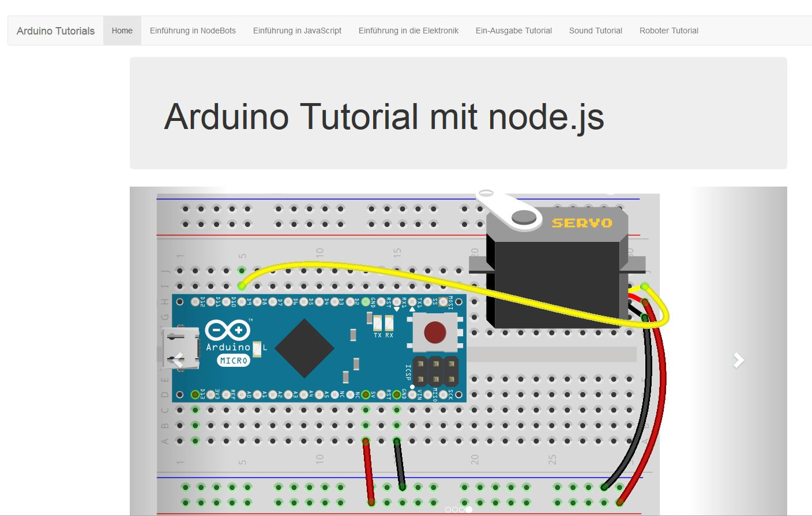

# NodeBots Tutorial 
NodeBots Tutorial mit Arduino, node.js und johnny-five



## Vorbereitung

Es wird node.js benötigt (v4.4.3 LTS ist ausreichend).

https://nodejs.org/en/


## Installation

Nach dem Download und auspacken des Archives die notwendigen Node Module aus dem Installations Verzeichnis installieren:

Für Linux:

```
git clone https://github.com/robotfreak/NodeBotsTutorial
cd ./NodeBotsTutorial
npm install
```

Für Windows [Archiv](https://github.com/robotfreak/NodeBots-Tutorial/archive/master.zip) downloaden, und entpacken nach NodeBotsTutorial

```
cd NodeBotsTutorial
npm install
```

## Ausführen

Start des Express Web-Servers aus dem Installations Verzeichnis:

```
npm start
```

Der Web-Server ist dann im Browser unter folgender Adresse zu erreichen:

```
127.0.0.1:3000
```
oder

```
http://localhost:3000/
```

Die Beispielprogramme lädt man vom Installationsordner mit:

unter Linux:
```
node ./code/example.js
```

unter Windows:
```
node code\example.js
```
