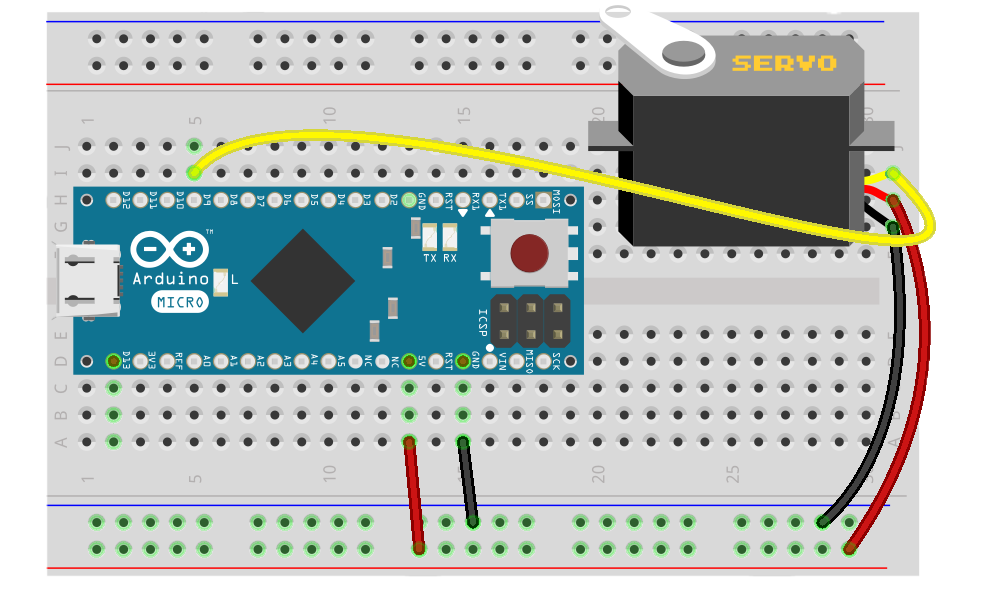

# Roboter Antriebe

Damit sich ein Roboter fortbewegen kann, benötigt er einen Antrieb, einen Motor.

## Tutorials

* [Motor](exercises/motor)
* [2-fach Motor Treiber](exercises/dual-motor)
* [Servo](exercises/servo)
* [Roboterkopf mit Pan/Tilt Servos](exercises/servo-pan-tilt)
