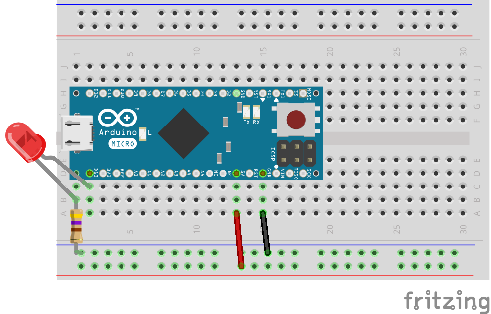
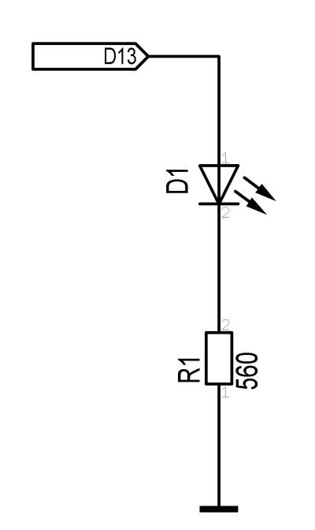
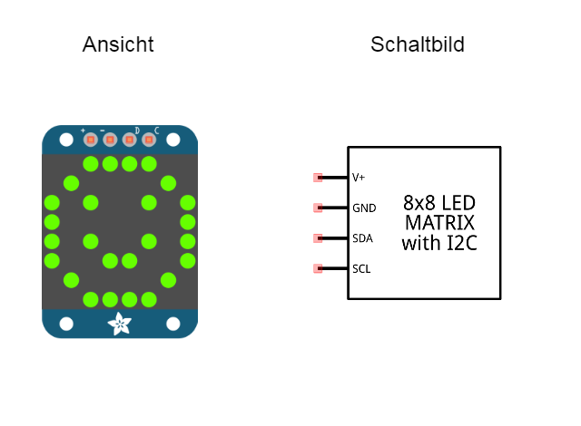
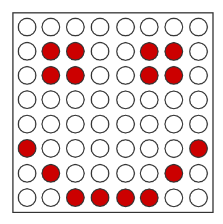
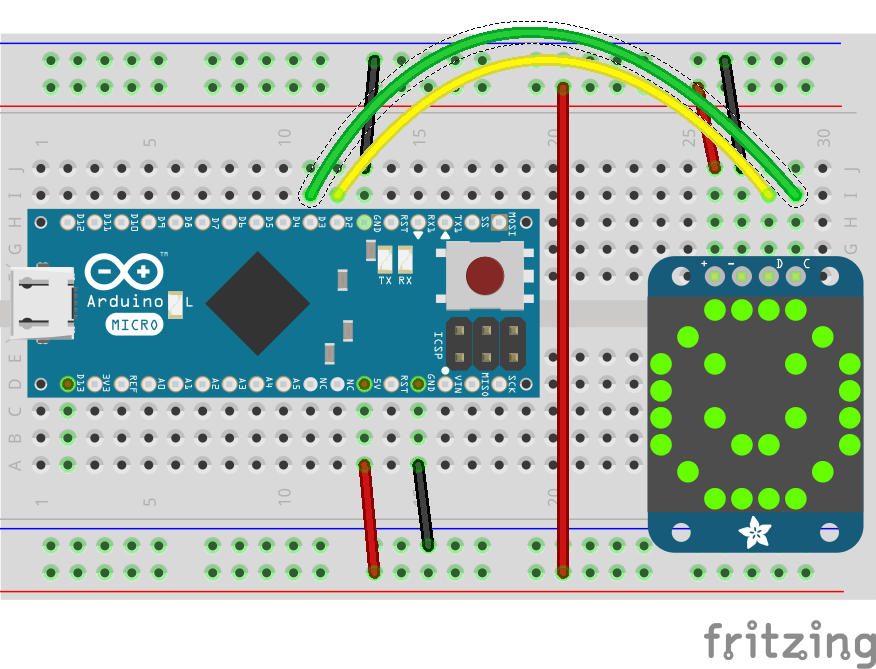
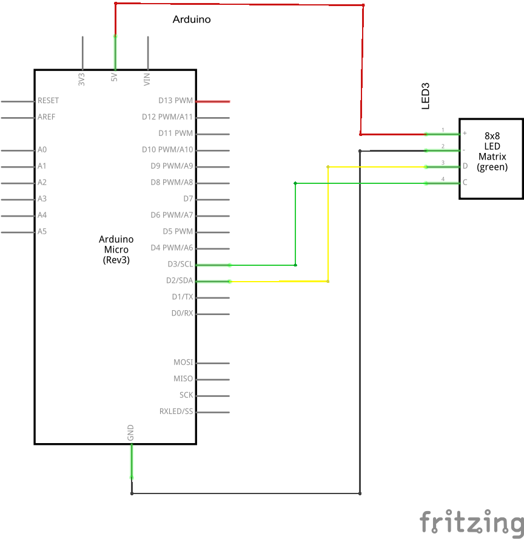

# Roboter Anzeigen

Damit sich der Roboter bemerkbar machen kann, falls er ein Problem hat, sind Anzeigen ein ganz wichtiges Thema. Darum geht es in diesem Teil des Robotik Tutorials.

Starte die Anwendung zu diesem Tutorial  im Terminal Fenster mit dem Befehl: 

```node code/robot-displays.js```

## LED

Eine LED ist wohl die einfachste Form der Anzeige. Sie kann z.B. als Status Anzeige dienen. 


### Schaltung

Zum Betrieb einer LED ist immer ein Widerstand notwendig, der in Reihe zur LED geschaltet wird.





### Programm

```javascript
var five = require("johnny-five"),
    button, led;

five.Board().on("ready", function() {

  led = new five.Led(13);

  led.strobe( 1000 );

  // make myLED available as "led" in REPL

  this.repl.inject({
  	led: led
  });
	  
  // try "on", "off", "toggle", "strobe", "stop" (stops strobing)
});
```


### Übungen

Du kannst die LED auch über das Terminal Fenster steuern. 

Probiere folgende Parameter für die Funktion `led` aus (z.B. `led.pulse`). Einige Funktionen erwarten auch einen Parameter, wie z.B. `led.fadeIn(500)`

```
  "on", "off", "toggle", "brightness",
  "fade", "fadeIn", "fadeOut",
  "pulse", "strobe",
```

Zum Beenden einer Animation wie `strobe, pulse oder fade` gib `led.stop` ein


## LED Matrix

Eine LED Matrix besteht aus mehreren LEDs die üblicherweise in Form einer Matrix von z.B. 8x8 LEDs angeordnet sind. Damit lassen sich gegenüber einer einzelnen LED noch mehr Informationen darstellen. Neben Zahlen und Buchstaben sind damit auch kleine Grafiken wie Emojis möglich. Allerdings ist es nicht ohne weiteres möglich, die 8x8 (64)  LEDs direkt  mit einem Mikrocontroller wie dem Arduino anzusteuern. Zum einen wegen der Stromaufnahme zum anderen wegen der schieren Anzahl von Anschluss Pins die dazu notwendig wären. Deshalb verfügen  LED-Matrizen über Schieberegister oder Port Erweiterungen um Anschluss Pins zu sparen. Die Adafruit LED Matrix 8x8 verfügen über ein I2C interface. Dafür werden nur 2 Pins benötigt. Mehrere Matrizen lassen sich parallel betreiben, da I2C ein serieller Bus ist.



Für eine 8x8 Matrix werden insgesamt 64 Informationen benötigt, ob die entsprechend eLED an oder ausgeschaltet werden soll. Das sind 8 Bytes, je darzustellendes Zeichen Je 8 Bits pro Zeile bei insgesamt 8 Zeilen. Eigene Zeichen lassen sich recht einfach selbst erzeugen, wenn man im Programm die Binär Schreibweise für die 8 Zeilen wählt.

So sieht z.B. die Darstellung auf der LED-Matrix für einen Smiley aus:`




Und so der entsprechende Abschnitt im Programm:

```javascript
  var smile[
    "00000000",
    "01100110",
    "01100110",
    "00000000",
    "00000000",
    "10000001",
    "01000010",
    "00111100"
  ];
```

### Schaltung





### Programm

```javascript
var five = require("johnny-five");
var board = new five.Board();

board.on("ready", function() {

  var heart = [
    "01100110",
    "10011001",
    "10000001",
    "10000001",
    "01000010",
    "00100100",
    "00011000",
    "00000000"
  ];

   var matrix = new five.Led.Matrix({
    addresses: [0x70],
    controller: "HT16K33",
  });

  matrix.clear();
  matrix.draw(heart);

  // type `draw("shape_name")` into the repl to see the shape!  
  this.repl.inject({
    matrix: matrix,
    draw: function(shape) {
      matrix.draw(five.Led.Matrix.CHARS[shape]);
    }
  });
});
```


### Übungen

Du kannst die LED-Matrix  auch über das Terminal Fenster steuern. 

Probiere die Funktion `draw` mit verschiedenen Buchstaben, Zahlen und Sonderzeichen aus (z.B. `draw("$").für das Dollar-Zeichen. Es gibt aiuch einige Emojis, wie z.B. `draw("smile")` oder `draw("angryface")` 

## 7-Segment LED Anzeige

Eine Sonderform der LED Matrix ist die 7-Segment Anzeige. Mit den 7 LEDs können die Ziffern 0..9 und auch einige Buchstaben dargestellt werden. Das ist eine  feine Sache um z.B. den Wert eines Sensors oder einfach die aktuelle Uhrzeit anzuzeigen. Die Ansteuerung erfolgt identisch zur LED Matrix über I2C

### Schaltung

### Programm

### Übungen

## Mehrere LED Matrizen

Es können auch mehrere LED Matrizen über einen I2C Bus angesteuert werden. Dazu gibt es für jede Anzeige eine 2-3 stellige Adresse, die über Setzern von Lötbrücken geändert werden kann. Natürlich muss dann jede Anzeige eine eigene individuelle Adresse bekommen. So läßt sich z.B. aus 4 LED Matrizen ein Gesicht besteht aus zwei Augen (2 LED Matrizen) und einem Mund (ebenfalls 2 LED Matrizen). Damit ergeben sich noch mehr Anzeige Möglichkeiten und der Roboter erhält ein Gesicht um z.B. Gemütszustände anzuzeigen.


### Schaltung

### Programm

### Übungen


## Servos

Leider ist der Roboter Kopf noch etwas starr. es wäre schön, wenn er seinen Kopf auch bewegen könnte. Dafür gibt es sogennante Servos.  Ein Servo ist ein kleiner Getriebemotor mit eingebauter Elektronik. Im Gegensatz zu einem Getriebemotor dreht sich der Servo nicht kontinuierlich, sondern nur innerhalb eines bestimmten Winkels (180°). Der gewünschte Winkel wird dem Servo vom Mikrocontroller über den Servo Steuer Pin  mitgeteilt. Ein Impuls mit einer bestimmten Länge (zwischen 1..2ms)  wird vom Servo in den entsprechenden Winkel von 0..180° umgesetzt.

Mit 2 Servos kann sich der Roboterkopf in 2 Richtungen bewegen (zwischen rechts und links sowie oben und unten) . Man spricht hier auch von Freiheitsgraden. 

### Schaltung

### Programm

### Übungen

## Sensoren

Alles zusammen genommen ergibt sich mit den LED Matrizen und den Servo schon ein recht lebendiges Geschöpf, auch wenn der Roboter nach wie vor nur vorprogrammierte Bewegungen durchführen kann. Um auf  Ereignisse von außen mit bestimmten Verhaltensweisen reagieren zu können fehlen dem Roboter noch die nötigen Sinne, sprich die Sensoren, um seine Umwelt wahrzunehmen. Näheres dazu lernt man im Kapitel über Roboter Sensoren. 

