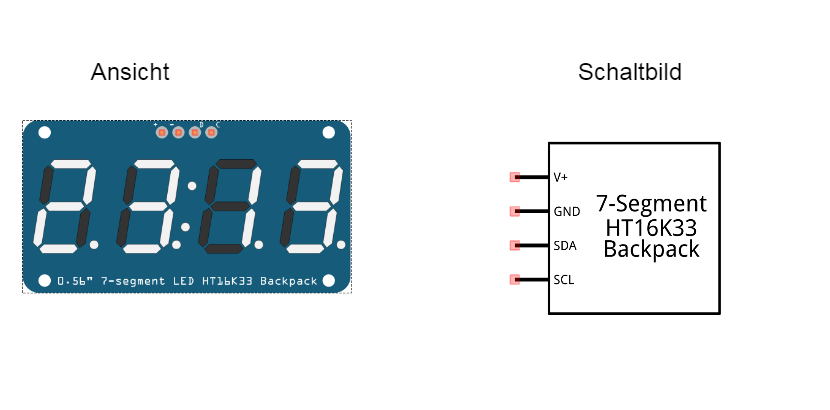
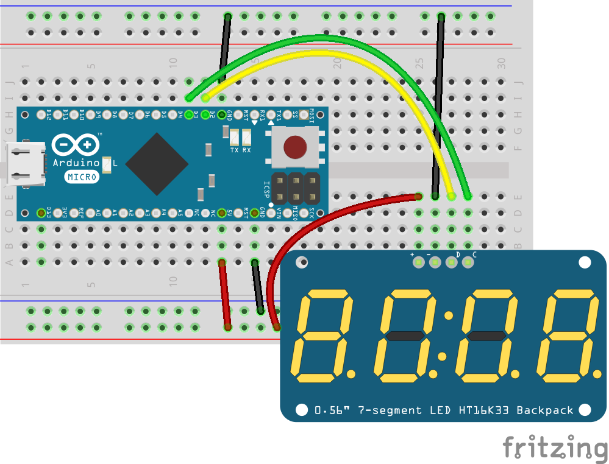
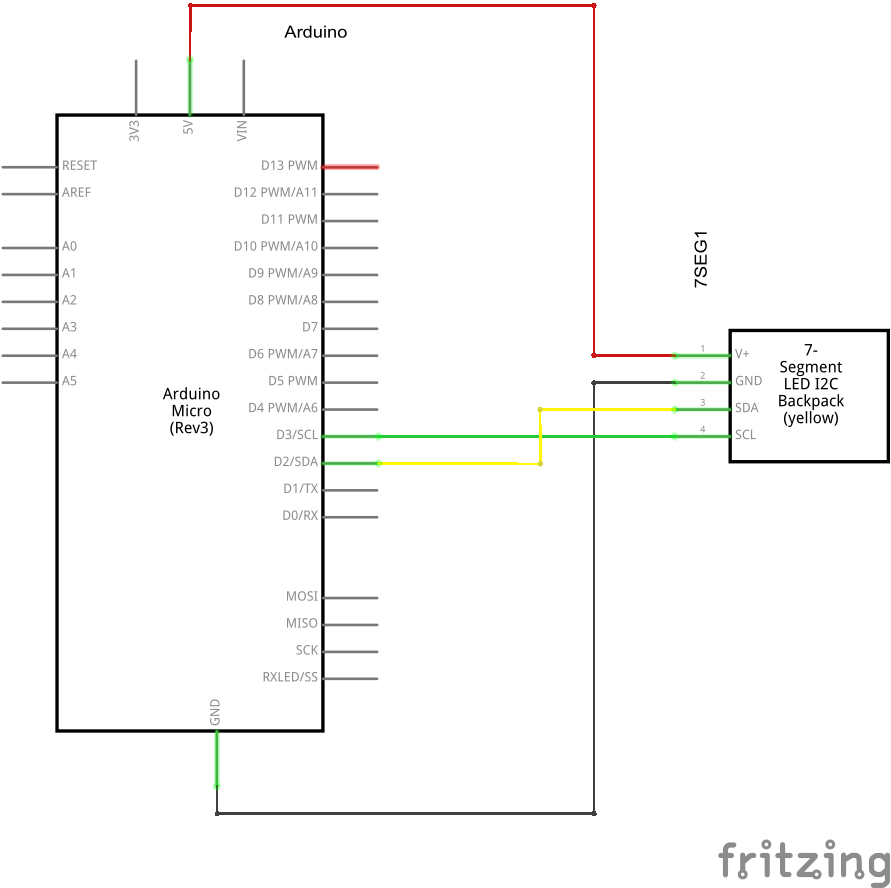

## 7-Segment Anzeige

Eine Sonderform der LED-Matrix ist die 7-Segment Anzeige. Mit den 7 LEDs können die Ziffern 0..9 und auch einige Buchstaben dargestellt werden. Das ist einefeine Sache um z.B. den Wert eines Sensors oder einfach die aktuelle Uhrzeit anzuzeigen. Die Ansteuerung erfolgt identisch zur LED Matrix über I2C.




### Schaltung





### Programm

Das Programm stellt eine Uhr auf der 7-Segment Anzeige dar. Es wird gestartet

unter Linux mit: 

```
node ./code/led-digits-clock-HT16K33.js
```

unter Windows mit:

```
node code\led-digits-clock-HT16K33.js
```

```javascript
var moment = require("moment");
var five = require("johnny-five");
var board = new five.Board({
});

board.on("ready", function() {
  var digits = new five.Led.Digits({
    controller: "HT16K33",
  });
  var toggle = 0;

  setInterval(function() {
    // Toggle the colon part: on for a second, off for a second.
    digits.print(time(toggle ^= 1));
  }, 1000);
});

function time(showColon) {
  var display = "    " + moment().format(
    showColon ? "h:mm" : "h mm"
  );
  return display.slice(-5);
}

```

