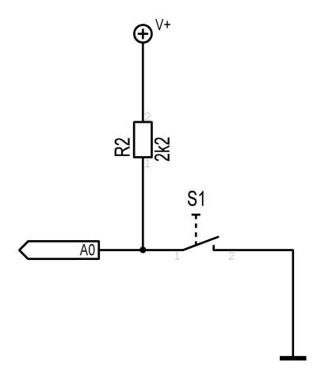

## Taster

In dieser Übung lernen wie ein Eingabe Element kennen, den Taster. In der folgenden Übung wird der Zusatnd eines Tasters abgefragt und der Zustand über die LED und die Konsole angezeigt.
```shell
node code/button.js
```

Drücke `Control-D` um das Program zu beenden.

### Teileliste

* Arduino Micro
* Steckplatine
* Drahtbrücken Set
* 5mm LED 
* Taster 10x10mm
* 680 Ohm Widerstand (blau-grau-braun)
* 2,2 kOhm Widerstand (rot-rot-rot)

### Schaltplan und Verdrahtung

Die Verdrahtung:


Der Schaltplan:




### Programm

Das Javascript Programm befindet sich unter `code/button.js`

```javascript
var five = require("johnny-five"),
    button, led;

five.Board().on("ready", function() {

  button = new five.Button({
    pin: "A0",
    invert: true  // Taster ist active low
  });
 
  led = new five.Led(13);

  button.on("up", function(){
    led.off();
    console.log("up");
  });

  button.on("hold", function(){
    console.log("hold");
  });

  button.on("down", function(){
    led.on();
    console.log("down");
  });
});
```

### Mehr Informationen

* [Johnny-Five LED Beispiele](http://johnny-five.io/examples/button/)
* [Johnny-Five LED API](http://johnny-five.io/api/button)
