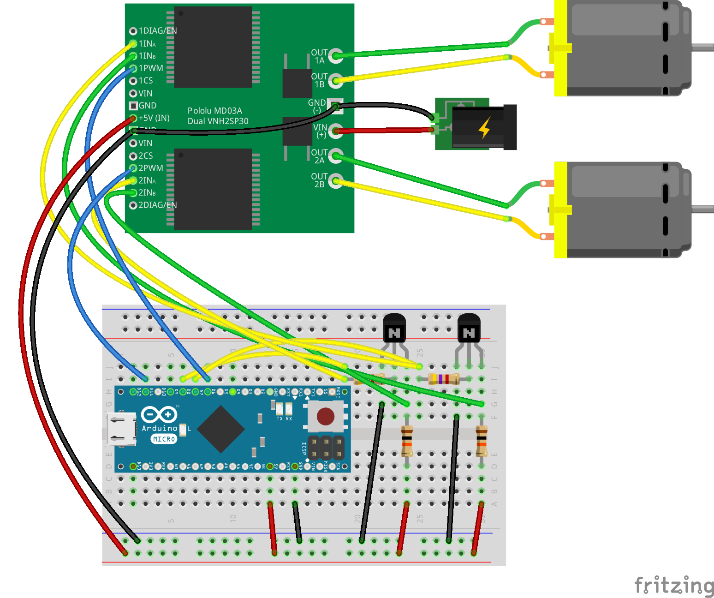
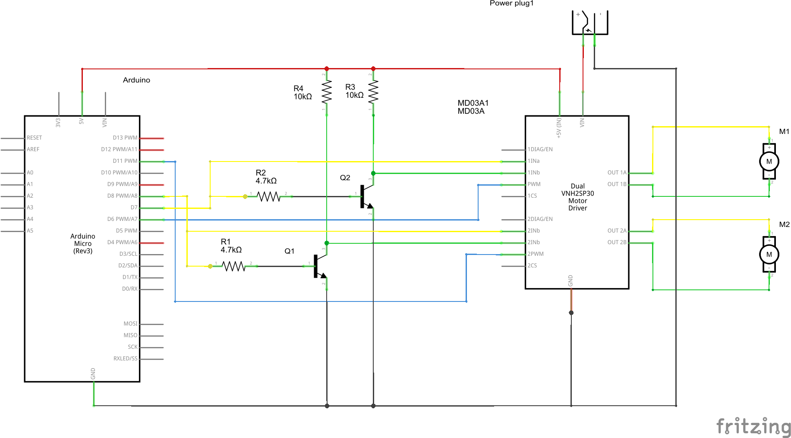

## 2-fach Motor Treiber

### Schaltung





### Programm

```JavaScript
var five = require("johnny-five");

var board = new five.Board();

board.on("ready", function() {
  console.log('ready');

  var rightWheel = new five.Motor({
    pins: { pwm: 11, dir: 8 }
  });

  var leftWheel = new five.Motor({
    pins: { pwm: 6, dir: 7 }
  });

  var speed = 100;

  function reverse() {
    leftWheel.reverse(speed);
    rightWheel.reverse(speed);
  }

  function forward() {
    leftWheel.forward(speed);
    rightWheel.forward(speed);
  }

  function stop() {
    leftWheel.stop();
    rightWheel.stop();
  }

  function left() {
    leftWheel.reverse(speed);
    rightWheel.forward(speed);
  }

  function right() {
    leftWheel.forward(speed);
    rightWheel.reverse(speed);
  }

  function exit() {
    leftWheel.stop();
    rightWheel.stop();
    setTimeout(process.exit, 1000);
  }

  var keyMap = {
    '8': forward,
    '2': reverse,
    '4': left,
    '6': right,
    '5': stop,
    'q': exit
  };

  var stdin = process.stdin;
  stdin.setRawMode(true);
  stdin.resume();

  stdin.on("keypress", function(chunk, key) {
      if (!key || !keyMap[key.name]) return;      

      keyMap[key.name]();
      board.wait(1000, function() {
        stop();
      });
    });
});
```

### Übungen

Mit den Nummern Tasten der Tastatur kann der Roboter gesteuert werden. 
