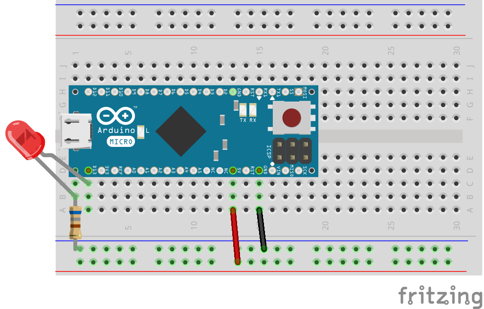

Das einfachste Arduino Programm, in Anlehnung an das einfachste C Programm 'Hallo Welt', wird 'Hallo Arduino' genannt. Dabei wird eine LED (light emitting diode) zum Blinken gebracht.

Zu Beginn werden die in der Teileliste gennannten Bauteile benötigt.

**Vor dem Zusammenbau ist es notwendig das Arduino Board vom PC zu trennen. Das ist ebenso immer notwendig, wenn Bauteile entfernt oder dazugefügt werden.**

Wenn alles zusammenbaut ist, kann der Arduino wieder mit dem PC verbunden werden. Danach wird das Programm aus dem `node-ardx-de` Verzeichnis über die folgende Kommadozeile gestarted:

```shell
node code/01-code-led.js
```

Über die Kommandozeile kann die LED auch über REPL Befehle (read–eval–print-loop) gesteuert werden. Gib dazu nach dem `>>` prompt `led.stop()` ein um die LED Animation zu stoppen. Danach kannst du Befehle wie  `led.on()`, `led.off()` ausprobieren. Drücke `Control-D` um das Program zu beenden.

## Teileliste

* Arduino Micro
* Steckplatine
* Drahtbrücken Set
* 5mm LED 
* 680 Ohm Widerstand (blau-grau-braun)

## Schaltplan und Verdrahtung

Der Verdrahtungsplan: 



Der Schaltplan:


## Programm

Das Javascript Programm befindet sich unter `code/01-code-led.js`

```javascript
var five = require("johnny-five"),
    button, led;

five.Board().on("ready", function() {

  led = new five.Led(13);

  led.strobe( 1000 );

  // make myLED available as "led" in REPL

  this.repl.inject({
  	led: led
  });
	  
  // try "on", "off", "toggle", "strobe", "stop" (stops strobing)
});
```

## Fehlersuche

### LED leuchtet nicht

Dioden sind gepolte Bauelemente. D.H. sie funktionieren nur in eine Richtung. Versuche die LED um 180° zu drehen (keine Sorge, die LED geht nicht kaputt, wenn sie falsch gepolt eingebeut wurde).


###  Das Programm meldet 'No USB devices detected'

Stelle sicher, dass das Arduino mit dem Computer über USB verbunden ist.

### es funktioniert immer noch nicht

Es kommt vor das Johnny-Five nicht mit dem Arduino über den USB COM Port kommunizieren kann. Stelle sicher, das die Arduino IDE beendet wurde. Wenn das Probelm immer noch besteht, kann man das Programm so ändern, dass Johnny-Five den richtigen USB COM Port verwendet:

```javascript
var board = new j5.Board({port:'COM7'});
```

## Programm erweitern

###Ändern des Pin:

Die LED ist mit Pin 13 verbunden,aber man auch jeden anderen Arduino Pin verwenden. Zum Ändern ziehe zuerts das USB Kabel vom Arduino an. Ändere die Leitung von der LED Anode zum Arduino, z.B. auf Pin Analog 0 (A0). Ja man kann auch die analogen Eingänge als digital Ausgänge verwenden:

```javascript
var ledPin = "A0";
led = new Five.Led(ledPin); 
```

### Ändern der Blinkzeit:

Die Blinkzeit läßt sich ebenfalls ändern. Der Parameter, welcher der myLed.strobe() Funktion übergeben wird, sind Milli Sekunden:

```javascript
led.strobe(1000);
```

### Steuern der Helligkeit:

Im nächsten Beispiel werden wir lernen, wie man die Helligkeit der LED ändern kann

## Mehr Informationen
* [Johnny-Five LED Beispiele](http://johnny-five.io/examples/led/)


