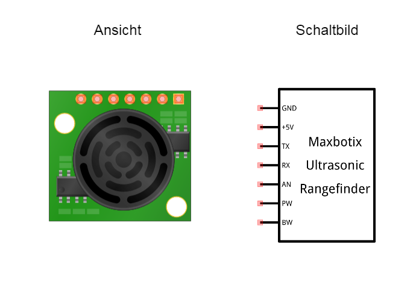
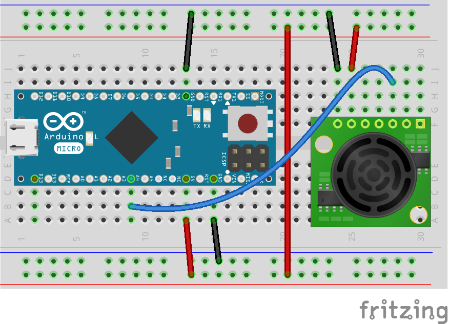
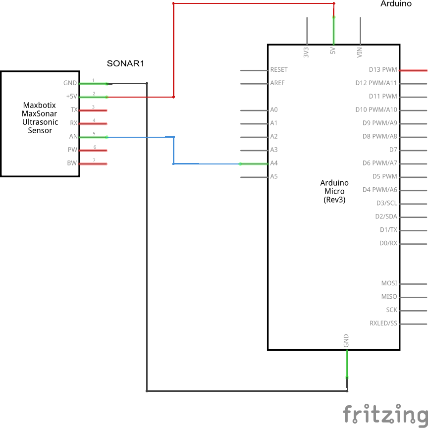

## Ultraschall Distanz Sensor

Ultraschall Sensoren funktionieren nach dem Prinzip der [Echoortung](https://de.wikipedia.org/wiki/Echoortung). Dabei werden über einen speziellen Lautsprecher kurze Pulse von Schallwellen im Ultraschall Bereich ausgesendet und über ein Mikrofon wieder empfanegen. Aus der gemssenen Laufzeit, die das Siganl braucht (nach dem Senden bis zzm Empfang) kann die Entfernung zu einem Objekt bestimmt werden.  

Ultraschall Sensoren gibt es mit verschiedenen Anschluss Möglichketiten. Die meisten Sensoren benötigen ein oder zwei digital Pins zur Ansteuerung, wie der Parallax Ping, Devantech SR-04 SR-05 oder der preiswerte China Klon HC-SR04. Dabei wird ein Trigger Signal ausgegeben und die Pulslänge über den Echo Eingang gelesen. Leider wird  das Messen von Pulslängen ( pulseIn() Funktion) über das Standard Firmata Sketch nicht unterstützt. Es gibt allerdings eine angepasste Firmata Verison, auf die ich aber an dieser Stelle nicht weiter eingehen möchte.

Deshalb kommt hier ein Sensor mit analoger Ansteuerung zum Einsatz, der Maxbotix EZ1. Die Spannung am Ausgangssignals läßt sich einfach in die gemessene Entfernng zum Hindernis umrechnen. 

### Schaltung

### Programm

### Übungen

