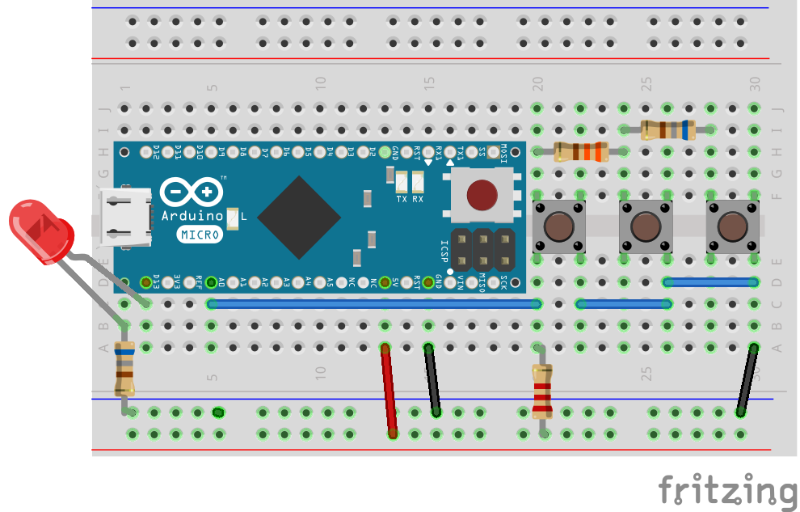
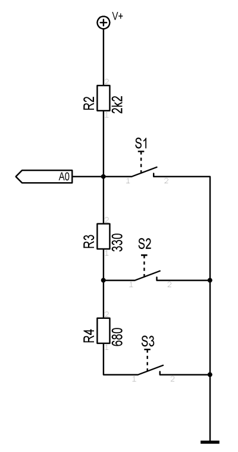

## Tastatur

In dieser Übung erweitern wir den vorhandenen Taster um zwei weitere Taster. Das besondere dabei, es wird weiterhin nur ein Eingangs Pin benötigt. Der Zustand der Taster wird über verschiedene LED Zustände angezeigt.

Es werden neben Bauteile aus der vorhergehenden Übung werden zwei weitere Taster und zwei weitere Widerstände benötigt. Die Taster werden über ein Widerstandsnetzwerk am Analog Eingang A0 angeschlossen, die LED wie vorher auch an Pin 13.

```shell
node code/keypad-analog-ad.js`
```
Drücke `Control-D` um das Program zu beenden.

## Teileliste

* Arduino Micro
* Steckplatine
* Drahtbrücken Set
* 5mm LED 
* 3x Taster 10x10mm
* 2,2 kOhm Widerstand (rot-rot-rot)
* 330 Ohm Widerstand (orange-orange-braun)
* 2 x 680 Ohm Widerstand (blau-grau-braun)

## Schaltplan und Verdrahtung

Die Verdrahtung:



Der Schaltplan:




## Programm

Das Javascript Programm befindet sich unter `code/04-code-3xbutton.js`

```javascript
var five = require("johnny-five");
var board = new five.Board();

board.on("ready", function() {
  // AD Keypad
  var keypad;

  keypad = new five.Keypad({
    pin: "A0",
    keys: ["red", "green", "blue", "3", "yellow", "white", "6"]
  });

  ["change", "press", "hold", "release"].forEach(function(eventType) {
    keypad.on(eventType, function(data) {
      console.log("Event: %s, Target: %s", eventType, data.which);
    });
  });
});
```
## Mehr Informationen

* [Johnny-Five Taster Beispiele](http://johnny-five.io/api/button/)
* [Johnny-Five Taster API](http://johnny-five.io/api/button)
