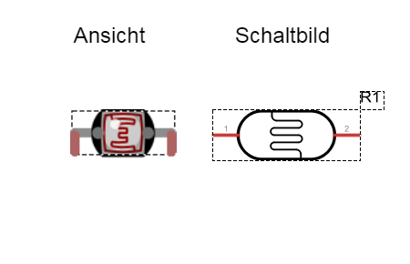
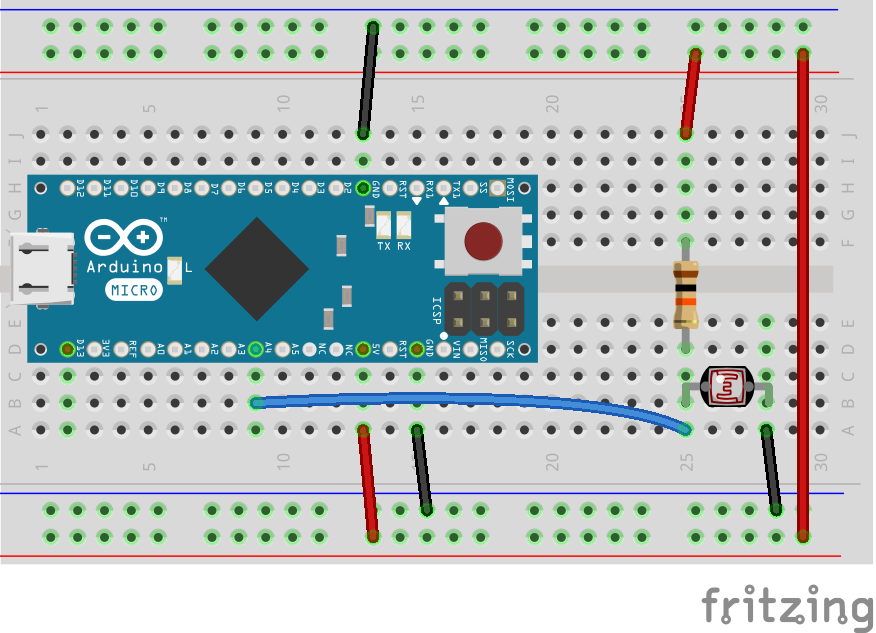
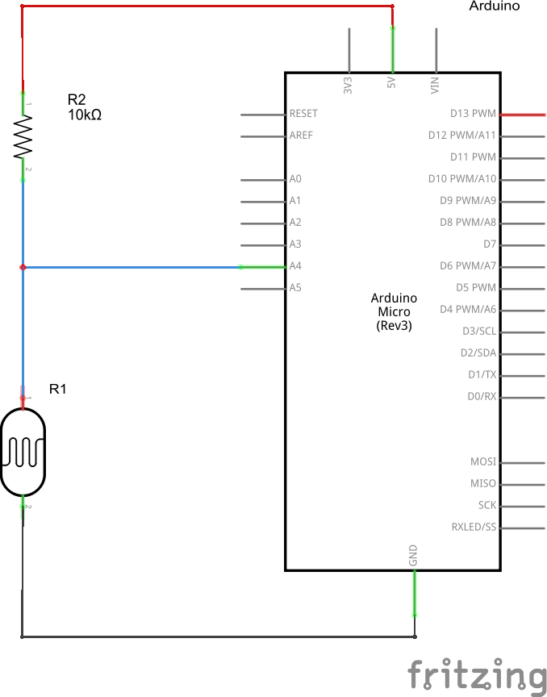

## Licht-Sensor 

Der erste Sensor, den wir kennenlernen werden ist ein Licht-Sensor. Der Licht-Sensor ist ein Bauteil, dessen elektrischer Widerstand sich mit der Helligkeit des eintreffenden Lichts ändert. Der Mikrocontroller auf dem Roboter kann den Widerstand indirekt über die Spannung  messen, die am Widerstand abfällt. Ändert sich der Widerstand, so ändert sich auch die Spannung (gemäß dem Ohmschen Gesetz). Um die Spannung messen zu können, verfügt der Mikrocontroller über analoge Eingänge. Die Spannung, die am analogen Eingang anliegt (im Bereich 0..5V) wird in einen äquivalenten Digitalwert umgerechnet und kann so vom Mikrocontroller verarbeitet werden.



Für einen Roboter mit Licht-Sensor(en) können zwei Verhalten programmiert werden. Zm einen die “Motte”, die ja bekanntlich eine Lichtquelle umkreist, weil sie denkt es sei der Mond. Zum anderen die “Kakerlake”, die im Gegensatz zur Motte das Licht meidet und lieber ein schattiges Plätzchen bevorzugt.  

### Schaltung





### Programm

```javascript
var five = require("johnny-five"),
  board, photoresistor;

board = new five.Board();

board.on("ready", function() {

  // Create a new `photoresistor` hardware instance.
  photoresistor = new five.Sensor({
    pin: "A2",
    freq: 20
  });

  // Inject the `sensor` hardware into
  // the Repl instance's context;
  // allows direct command line access
  board.repl.inject({
    pot: photoresistor
  });

  // "data" get the current reading from the photoresistor
  photoresistor.on("data", function() {
    console.log("Lichtwert: ");
    console.log(this.value);
    console.log("-----------------");
  });
});
```

### Übungen

Lege deine Hand über den Licht-Sensor um so das einfallende Licht abzuschatten. Beobachte dazu die ausgegebenen Werte im Terminal.

Gib im Terminal Fenster das Kommando `mode("moth")` ein, um den Roboter in eine “Motte” zu verwandeln.
 
Gib im Terminal Fenster das Kommando `mode("cockroach")` ein, um den Roboter in eine “Kakerlake” zu verwandeln. Vergleiche das Verhalten des Roboters als Kakerlake mit dem der Motte


