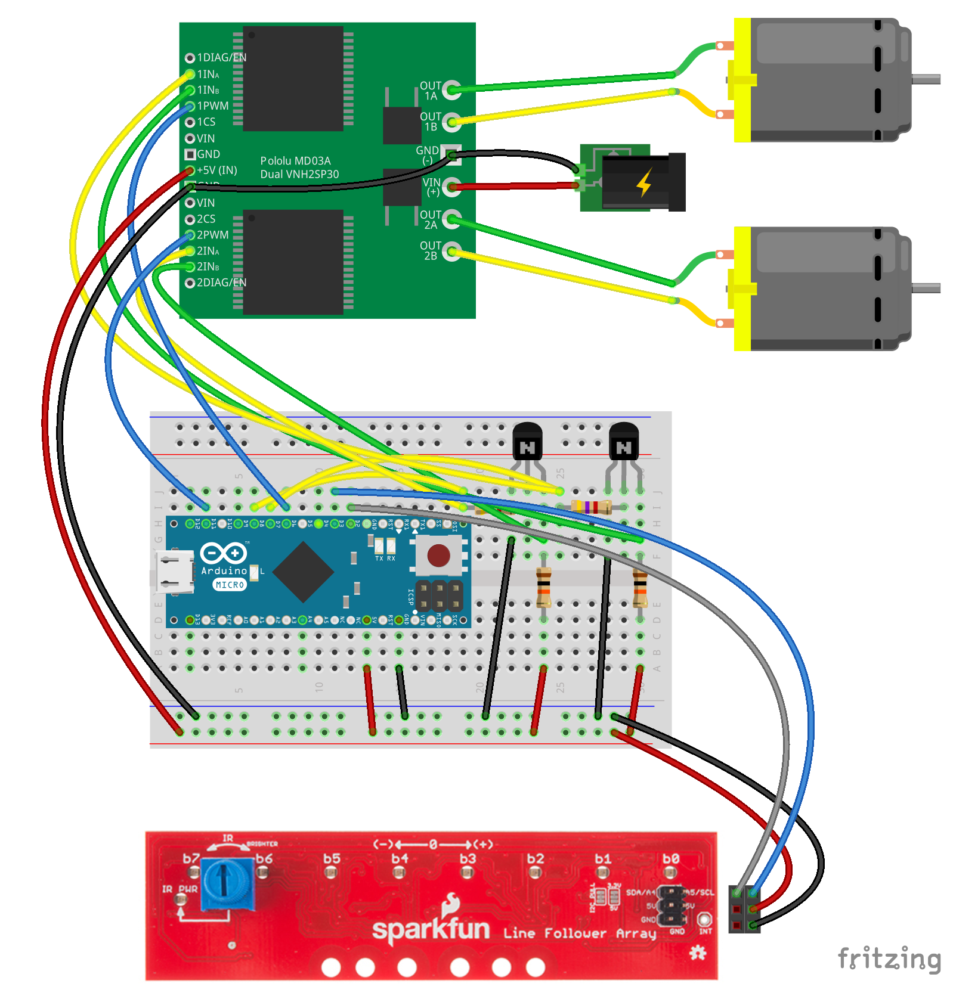

## Linienfolger

Ein Roboter der einer Linie auf dem Boden folgen kann

### Was wird benötigt?

* [Linien-Sensor](./line-sensor)
* Roboter Chasssis mit 2 Motoren und [2-fach Motor-Treiber](./dual-motor)

### Schaltplan



### Programm

```javascript
var five = require("johnny-five");
var board = new five.Board();

board.on("ready", function() {

  var rightWheel = new five.Motor({
    pins: { pwm: 6, dir: 7 }
  });

  var leftWheel = new five.Motor({
    pins: { pwm: 11, dir: 8 }
  });

  var speed = 100;

  function reverse() {
    leftWheel.reverse(speed);
    rightWheel.reverse(speed);
    console.log("backward");
  }

  function forward() {
    leftWheel.forward(speed);
    rightWheel.forward(speed);
    console.log("forward");
  }

  function stop() {
    leftWheel.stop();
    rightWheel.stop();
    console.log("stop");
  }

  function left() {
    leftWheel.reverse(speed);
    rightWheel.forward(speed);
    console.log("left");
  }

  function leftForward() {
    leftWheel.forward(speed);
    rightWheel.stop(0);
    console.log("left forward");
  }
  function leftReverse() {
    leftWheel.reverse(speed);
    rightWheel.stop(0);
    console.log("left backward");
  }
  function right() {
    leftWheel.forward(speed);
    rightWheel.reverse(speed);
    console.log("right");
  }
  function rightForward() {
    rightWheel.forward(speed);
    leftWheel.stop();
    console.log("right forward");
  }
  function rightReverse() {
    rightWheel.reverse(speed);
    leftWheel.stop();
    console.log("right backward");
  }

  function exit() {
    leftWheel.stop();
    rightWheel.stop();
    setTimeout(process.exit, 1000);
  }

  var register = {
        PULLUPB: 0x06,
        PULLUPA: 0x07,
        DIRB: 0x0E,
        DIRA: 0x0F,
        DATAB: 0x10,
        DATAA: 0x11,
        INTMASKA: 0x13,
        MISC: 0x1E,
        CLOCK: 0x1F,
        RESET: 0x7D
  };

  var address = 0x3E;
  console.log("address: ", address);

  this.i2cConfig();
  // Reset
  this.i2cWriteReg(address, register.RESET, 0x12);
  this.i2cWriteReg(address, register.RESET, 0x34);
  this.i2cReadOnce(address, register.INTMASKA, 2, function(data) {
    var value;
    value = (data[0] << 8) + data[1];
    console.log("read: ", value);
  });
  // Port A all Input
  this.i2cWriteReg(address, register.DIRA, 0xFF);
  // Port B Input 0,1 output, 2..7 Input
  this.i2cWriteReg(address, register.DIRB, 0xFC);
  // Port B IR LED off, FB LED on
  this.i2cWriteReg(address, register.DATAB, 0x01);
  // Port B IR LED on, FB LED off
  //this.wait(1, function() { 
  this.i2cWriteReg(address, register.DATAB, 0x02); 
  //});

  board.loop(1000, function() {
    //this.wait(2, function() { 
      // Port B IR LED on, FB LED on
    this.i2cWriteReg(address, register.DATAB, 0x00); 
    //;
    this.i2cReadOnce(address, register.DATAA, 1, function(data) {
      var value;
      value = data[0];
      console.log("read: ", value.toString(2));
      if (value & 0x18) { // on line
        forward();
      }
      else if (value & 0x06) { // right
        right();
      }
      else if (value & 0x60) { // left
        left();
      }
    });
    // Port B IR LED off, FB LED off
    //this.i2cWriteReg(address, register.DATAB, 0x03);  
  });
});
```
