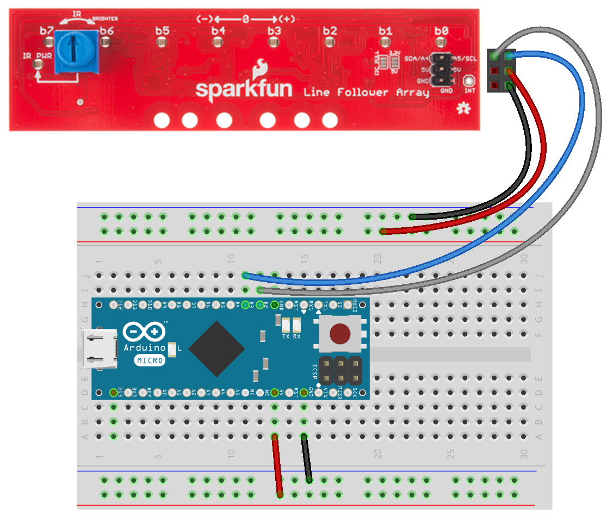

## LInien Sensor

Nit einem Linien Sensor kann ein Roboter einer Linie auf dem Boden folgen. Wichtig ist dabei das sich die Linie vom Untergrund hervorhebt. Eine schwarze Linie auf weissem Untergrund wäre z.B. ideal.

Ein Linien Sensor besteht üblicherweise aus einem oder mehreren Infrarot Reflexkoppler. Hinter diesem etwas kryptischen Namen versteckt sich eine Art Lichtschranke. In dem Sensor stecken eine Lichtquelle (Infrarot Diode) und ein Lichtempfänger (Foto-Transistor) in einem gemeinsamen Gehäuse. Der Foto-Transistor empfängt das Licht der Infrarot Diode nur, wenn das Licht reflektiert wird. Da dunkle Farben das Licht schlechter reflektieren als helle, hängt der Wert der Ausgangsspannung am Transistor von der Farbe der Oberfläche ab. 

Mit einem einzelnen Sensor kann der Roboter bereits einer Linie folgen, zumindest fast. Es ist mehr ein herumeiern an der Grenze zwischen Linie und Untergrund. Man spricht hier eher einem Kantenfolger als von einem Linienfolger. Der Roboter verliert die Linie, steuert gegen bis er die Linie wiederfindet, verliert sie wieder usw. Deshalb der Eiertanz 

Mehrere Sensoren dieser Art lassen sich zu einem Sensor Array zusammenfassen. Damit kann der Roboter genau erkennen, wie weit weg sich die Linie von der Mittelachse des Roboters befindet und kann somit stärker gegensteuern, wenn sich die Linie unter den äußeren Sensoren befindet.

Normalerweise benötigen Linien-Sensoren zum Anschluss an den Mikrocontroller Analog Eingänge. Falls es analogen Eingängen mangelt, gibt es auch Linien Sensoren mit i2C Anschluss, wie das Sparkfun Line Sensor Array (8x Linen Sensor).

### Was wird benötigt?

* [Sparkfun Line Sensor Array](https://www.sparkfun.com/products/13582)

### Schaltung

### Programm

Das Sparkfun Line Sensor Array wird lieder nicht direkt von der Johny-Five Bibliothek unterstützt.

### Übungen

Bastle dir eine Linienfolger Vorlage. Dazu eignet sich ein weisses Blatt Papier und schwarzes Klebeband. Klebe eine Linie Klebeband auf das Papier, fertig. Bewege das Papier uner dem Sensor und beobachte die Sensorwerte

