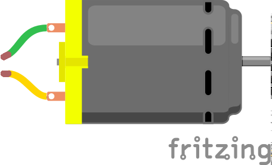
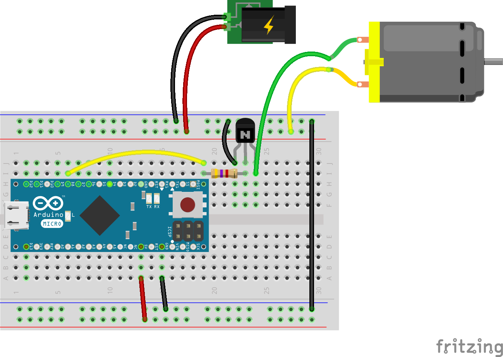
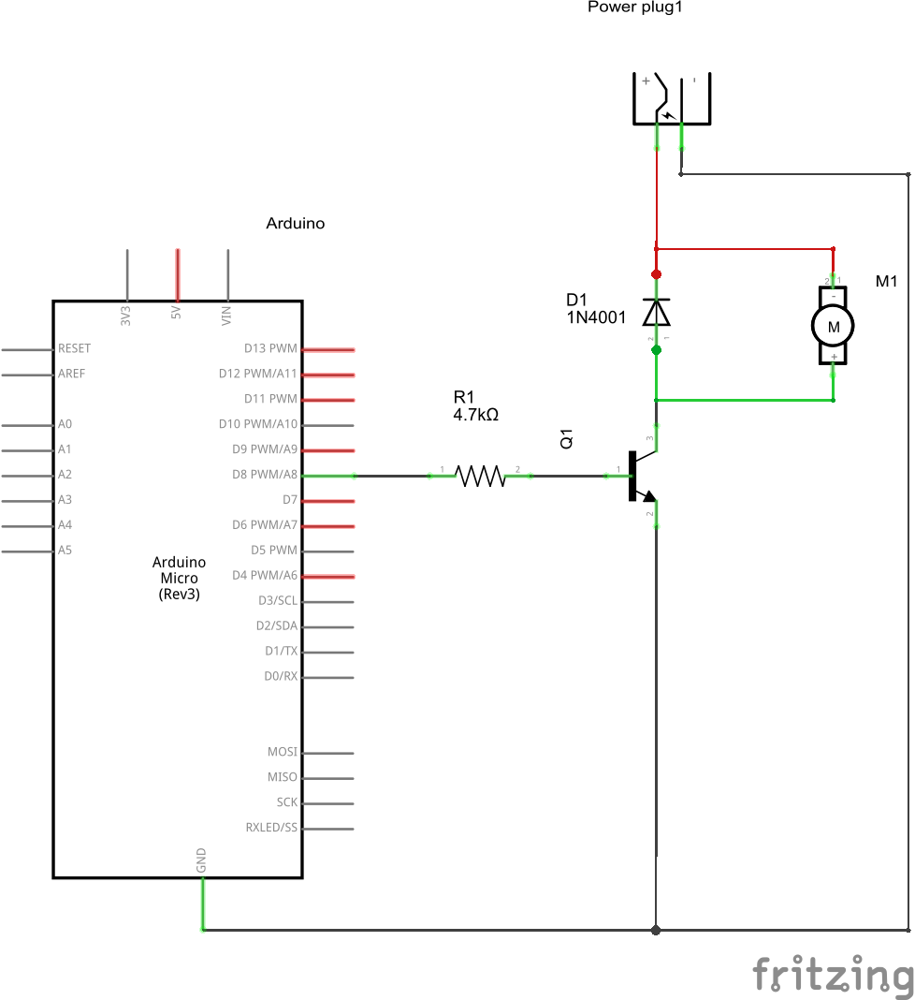

## Motor 

Damit sich der Roboter von der Stelle bewegen kann braucht er einen Motor. Der einfachste Motor ist der Gleichstrom Motor (DC-Motor). Dieser Motor dreht sich, sobald eine Gleichspannung angelegt wird. Je höher die Spannung ist, desto schneller dreht sich der Motor. Polt man die Spannung um, dreht sich der Motor in die andere Richtung. 

Zwar dreht so ein Gleichstrom Motor sich sehr schnell, bringt aber kaum Vortrieb auf die “Straße”, insbesondere je schwerer der Roboter ist. Was fehlt ist ein Getriebe um den Motor mehr "Kraft" zu verleihen. Das geht zwar nur auf Kosten der Geschwindigkeit bringt aber mehr Drehmoment. Damit schafft es auch ein relativ kleiner Motor viel Gewicht zu transportieren.



Die Motorwelle selbst reicht natürlich nicht um den Motor zu bewegen. Es muss auch noch ein Rad mit dem Motor verbunden werden.

### Schaltung

Da der Motor zu viel Strom zieht um ihn direkt an einen Pin des Mikrocontroller zu schalten, muss noch ein Treiber zwischen Motor und Mikrocontroller geschaltet werden. Im einfachsten Fall genügt ein [Transistor](../../parts/transistor). 

Da es sich bei einem Motor um eine induktive Lat handelt, ist auch eine [Schutzdiode](../../parts/diode) (in Sperrrichtung, parallel zum Motor geschaltet) obligatorisch. Der Grund: beim Abschalten des Motors, stoppt dieser nicht sofort, sondern dreht sich noch etwas weiter. Dabei wird der Motor zum Generator und indiziert eine Spannung. Diese Spannung wird über die Diode abgeleitet und verhindert die Zerstörung des Transistors.





### Programm

```JavaScript
var five = require("johnny-five"),
  board, motor, led;

board = new five.Board();

board.on("ready", function() {
  // Create a new `motor` hardware instance.
  motor = new five.Motor({
    pin: 5
  });

  // Inject the `motor` hardware into
  // the Repl instance's context;
  // allows direct command line access
  board.repl.inject({
    motor: motor
  });

  // Motor Event API

  // "start" events fire when the motor is started.
  motor.on("start", function() {
    console.log("start", Date.now());

    // Demonstrate motor stop in 2 seconds
    board.wait(2000, function() {
      motor.stop();
    });
  });

  // "stop" events fire when the motor is stopped.
  motor.on("stop", function() {
    console.log("stop", Date.now());
  });

  // Motor API

  // start([speed)
  // Start the motor. `isOn` property set to |true|
  // Takes an optional parameter `speed` [0-255]
  // to define the motor speed if a PWM Pin is
  // used to connect the motor.
  motor.start();

  // stop()
  // Stop the motor. `isOn` property set to |false|
});
```

### Übungen

## Differential Antrieb

Mit einem Motor  könnte der Roboter schon mal vorwärts und rückwärts fahren, wenn der Motor alle Räder des Roboters antreibt. Doch womit steuert man den Roboter, damit er auch rechts oder links fahren kann?

Ein zweiter Motor muss her. 

