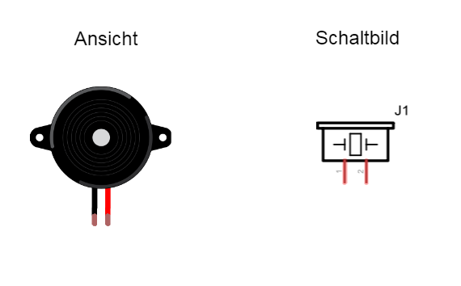

## Piezo Buzzer

Ein Piezo Buzzer ist ein kleiner Lautsprecher, der Signal-Töne ausgeben kann. 



### Schaltung

Nicht unbedingt notwendig ist die Transistor Stufe.


### Programm

Das Programm gibt eine Melodie aus. Erkennst du die Melodie? Es wird gestartet

unter Linux mit: 

```
node ./code/piezo.js
```

unter Windows mit:

```
node code\piezo.js
```

```javascript
var five = require("johnny-five"),
  board = new five.Board();

board.on("ready", function() {
  // Creates a piezo object and defines the pin to be used for the signal
  var piezo = new five.Piezo(5);

  // Injects the piezo into the repl
  board.repl.inject({
    piezo: piezo
  });

  // Plays a song
  piezo.play({
    // song is composed by an array of pairs of notes and beats
    // The first argument is the note (null means "no note")
    // The second argument is the length of time (beat) of the note (or non-note)
    song: [
      ["C4", 1 / 4],
      ["D4", 1 / 4],
      ["F4", 1 / 4],
      ["D4", 1 / 4],
      ["A4", 1 / 4],
      [null, 1 / 4],
      ["A4", 1],
      ["G4", 1],
      [null, 1 / 2],
      ["C4", 1 / 4],
      ["D4", 1 / 4],
      ["F4", 1 / 4],
      ["D4", 1 / 4],
      ["G4", 1 / 4],
      [null, 1 / 4],
      ["G4", 1],
      ["F4", 1],
      [null, 1 / 2]
    ],
    tempo: 100
  });

  // Plays the same song with a string representation
  piezo.play({
    // song is composed by a string of notes
    // a default beat is set, and the default octave is used
    // any invalid note is read as "no note"
    song: "C D F D A - A A A A G G G G - - C D F D G - G G G G F F F F - -",
    beats: 1 / 4,
    tempo: 100
  });

});
```

