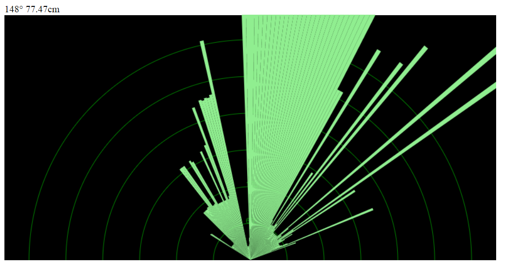

## Ultraschall Radar

Dieses Beispiel zeigt die Daten eines Ultraschall Sensors, der mit einem Servo geschwenkt wird, in einer Art Radar-Ansicht.   



### Was wird benötigt

* Ultraschallsensor, siehe [Ultraschallsensor](./ultrasonic)
* 4x Adafruit 8x8 LED Matrix mit I2C Backpack, siehe [Roboter Gesicht aus mehreren LED Matrizen](./multi-led-matrix)
* 2 Servos und Pan/Tilt Kopf, siehe [Roboter Kopf mit Servo Pan Tilt](./servo-pan-tilt)

### Programm

Das Programm verwendet den Browser zur Darstellung der Radar Bildes. Öffne dazu ein Browser-Fenster mit der Adresse ```http://localhost:8080``` und starte dann das Programm unter Linux mit ```node ./code/radar.js```, unter Windows mit ```node code\radar.js```

```javascript
var five = require("johnny-five"),
  child = require("child_process"),
  http = require("http"),
  socket = require("socket.io"),
  fs = require("fs"),
  app, board, io;

function handler(req, res) {
  var path = __dirname;

  if (req.url === "/") {
    path += "/radar.html";
  } else {
    path += req.url;
  }

  fs.readFile(path, function(err, data) {
    if (err) {
      res.writeHead(500);
      return res.end("Error loading " + path);
    }

    res.writeHead(200);
    res.end(data);
  });
}

app = http.createServer(handler);
app.listen(8080);

io = socket.listen(app);
io.set("log level", 1);

board = new five.Board();

board.on("ready", function() {
  var center, degrees, step, facing, range, scanner, soi, ping, last;


  // Open Radar view
  child.exec("open http://localhost:8080/");

  // Starting scanner scanning position (degrees)
  degrees = 21;

  // Servo scanning steps (degrees)
  step = 1;

  // Current facing direction
  facing = "";

  last = 0;

  // Scanning range (degrees)
  range = [20, 160];

  // Servo center point (degrees)
  center = range[1] / 2;

  // ping instance (distance detection)
  ping = new five.Proximity({
    controller: "MB1000",
    pin: "A4",
    freq: "100"
  });

  // Servo instance (panning)
  scanner = new five.Servo({
    pin: 4,
    range: range
  });

  this.repl.inject({
    scanner: scanner
  });

  // Initialize the scanner servo at 0°
  scanner.min();

  // Scanner/Panning loop
  this.loop(100, function() {
    var bounds, isOver, isUnder;

    bounds = {
      left: center + 5,
      right: center - 5
    };

    isOver = degrees > scanner.range[1];
    isUnder = degrees <= scanner.range[0];

    // Calculate the next step position
    if (isOver || isUnder) {
      if (isOver) {
        io.sockets.emit("reset");
        degrees = 20;
        step = 1;
        last = -1;
      } else {
        step *= -1;
      }
    }

    // Update the position by N° step
    degrees += step;

    // Update servo position
    scanner.to(degrees);
  });

  io.sockets.on("connection", function(socket) {
    console.log("Socket Connected");

    soi = socket;

    ping.on("data", function() {

      if (last !== degrees) {
        io.sockets.emit("ping", {
          degrees: degrees,
          distance: this.cm
        });
      }

      last = degrees;
    });
  });
});


// // Reference
// //
// // http://www.maxbotix.com/pictures/articles/012_Diagram_690X480.jpg

```
