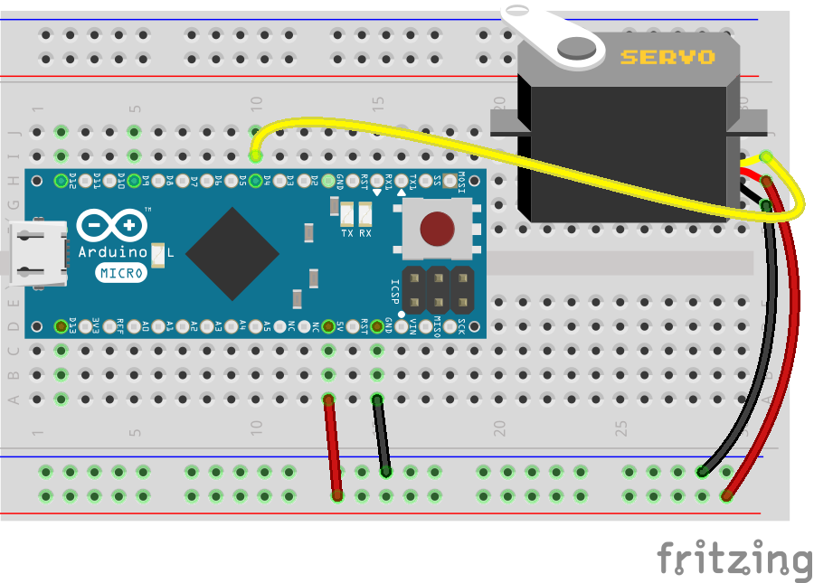

Als Anfang in die Roboter Programmierung starten wir mit der Ansteuerung eines Servos. Ein Servo ist ein kleiner Stell-Motor, 
Zu Beginn werden die in der Teileliste gennannten Bauteile benötigt.

**Vor dem Zusammenbau ist es notwendig das Arduino Board vom PC zu trennen. Das ist ebenso immer notwendig, wenn Bauteile entfernt oder dazugefügt werden.**

Wenn alles zusammenbaut ist, kann der Arduino wieder mit dem PC verbunden werden. Danach wird das Programm aus dem `node-ardx-de` Verzeichnis über die folgende Kommadozeile gestarted:

```shell
node code/servo-wave.js
```

Über die Kommandozeile kann die Schaltung auch über REPL Befehle (read–eval–print-loop) gesteuert werden. Gib dazu nach dem `>>` prompt ??? ein. Drücke `Control-D` um das Program zu beenden.

## Teileliste

* Arduino Micro
* Steckplatine
* 3 Testkabel (männlich/männlich)
* Servo

## Schaltplan und Verdrahtung

Der Verdrahtungsplan: 



## Programm

Das Javascript Programm befindet sich unter `code/servo-wave.js`

```javascript
var five = require("johnny-five");

five.Board().on("ready", function() {
  var servo = new five.Servo(4);
  servo.sweep();
  this.wait(5000, function() {
    servo.stop();
    servo.center();
  });
});
```

## Fehlersuche

### Die Verbindung zum Board geht verloren, der Controller resetted sich

Servos können schon recht viel Strom ziehen. Das kann schon zuviel sein für den USB Anschluss. Darüber dürfen maximal 500mA Strom fliessen. Zieht der Servo zu viel Strom, bricht die Stromversorgung zusammen und der Arduino vollzieht einen Neustart.

Abhilfe schafft hier eine eigene Stromversorgung für den Servo. Der Servo benötigt eine Sappnung zwischen 4,8 und 6V.

###  Das Programm meldet 'No USB devices detected'

Stelle sicher, dass das Arduino mit dem Computer über USB verbunden ist.

### es funktioniert immer noch nicht

Es kommt vor das Johnny-Five nicht mit dem Arduino über den USB COM Port kommunizieren kann. Stelle sicher, das die Arduino IDE beendet wurde. Wenn das Probelm immer noch besteht, kann man das Programm so ändern, dass Johnny-Five den richtigen USB COM Port verwendet:

```javascript
var board = new j5.Board({port:'COM7'});
```

## Programm erweitern

## Mehr Informationen

* [Johnny-Five Servo Beispiele](http://johnny-five.io/examples/??servo/)

