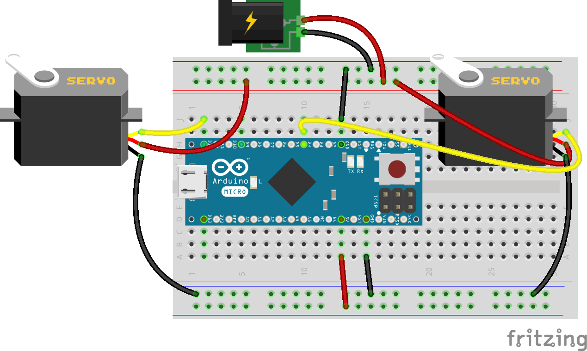
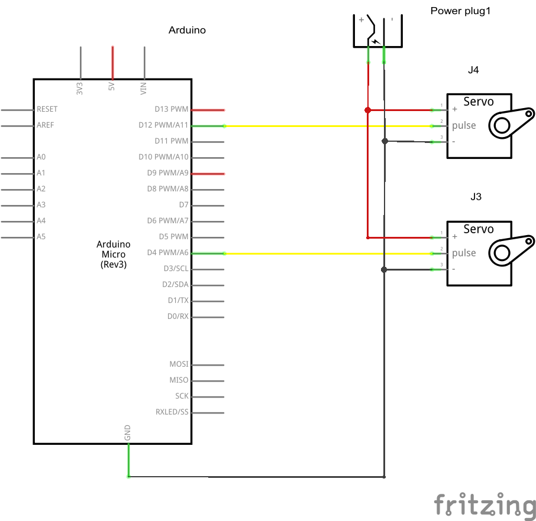

## Servo Pan Tilt

Mit 2 Servos kann sich der Roboterkopf in 2 Richtungen bewegen, Pan & Tilt (Schwenken und Neigen) ist hierzu der Fachbegriff aus der Videotechnik.

### Schaltung





### Programm

```JavaScript
var five = require('johnny-five')
var board = new five.Board()

board.on('ready', function () {
  var servoPan = new five.Servo({ pin: 4,
                                  range: [20,160]});
  var servoTilt = new five.Servo({ pin: 12,
                                  range: [20,160]});

  function down() {
    servoTilt.min();
  }

  function up() {
    servoTilt.max();
  }

  function left() {
    servoPan.max();
  }

  function right() {
    servoPan.min();
  }

  function stop() {
    servoPan.center();
    servoTilt.center();
  }

  function exit() {
    servoPan.stop();
    servoTilt.stop();
    setTimeout(process.exit, 1000);
  }

  var keyMap = {
    'up': up,
    'down': down,
    'left': left,
    'right': right,
    'space': stop,
    'q': exit
  };

  var stdin = process.stdin;
  stdin.setRawMode(true);
  stdin.resume();

  stdin.on("keypress", function(chunk, key) {
      if (!key || !keyMap[key.name]) return;      

      keyMap[key.name]();
  });
});
```

### Übungen

Über die Cursor Tasten der Tastatur kann der Roboterkopf bewegt werden.
