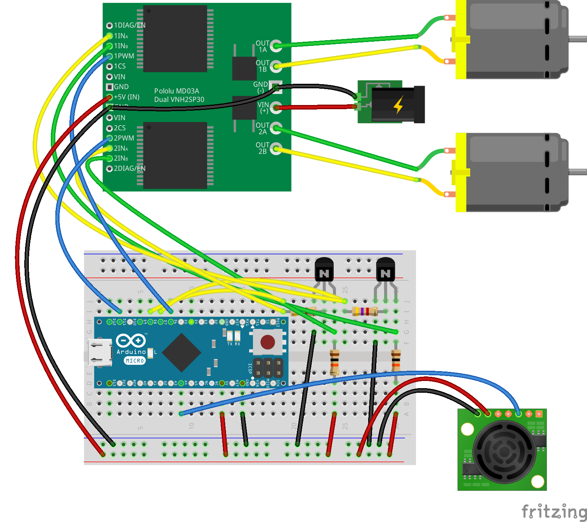

## Spy-Cam

Ein Roboter der ferngesteuert werden kann und dabei ein Live Bild zum Web Browser streamt. Die Kamera kann über den Servo Kopf geneigt und geschwenkt werden.

### Was wird benötigt?

* 2 Servos und Pan/Tilt Kopf, siehe [Roboter Kopf mit Servo Pan Tilt](./servo-pan-tilt)
* Roboter Chasssis mit 2 Motoren und [2-fach Motor-Treiber](./dual-motor)
* Raspberry Pi mit Pi Camera
* [mjpeg-streamer](https://github.com/jacksonliam/mjpg-streamer) zum Streamen des Videos

### Schaltplan



### Programm

Über die Cursor Tasten kann der Roboter bewegt werden. Die Kamera kann mit den Tasten 'a' und 'd' geschwenkt, 'w' und 'x' geneigt und mit 's' in die Mittenposition gesteuert werden. Die Live Video Ausgabe erfolgt im Browser unter der Adresse 'http://localhost:8080/simple-stream.html'

Es wird unter Linux mit `node ./code/spy-cam.js` unter Windows mit `node code\spy-cam.js` gestartet.

```javascript
```
