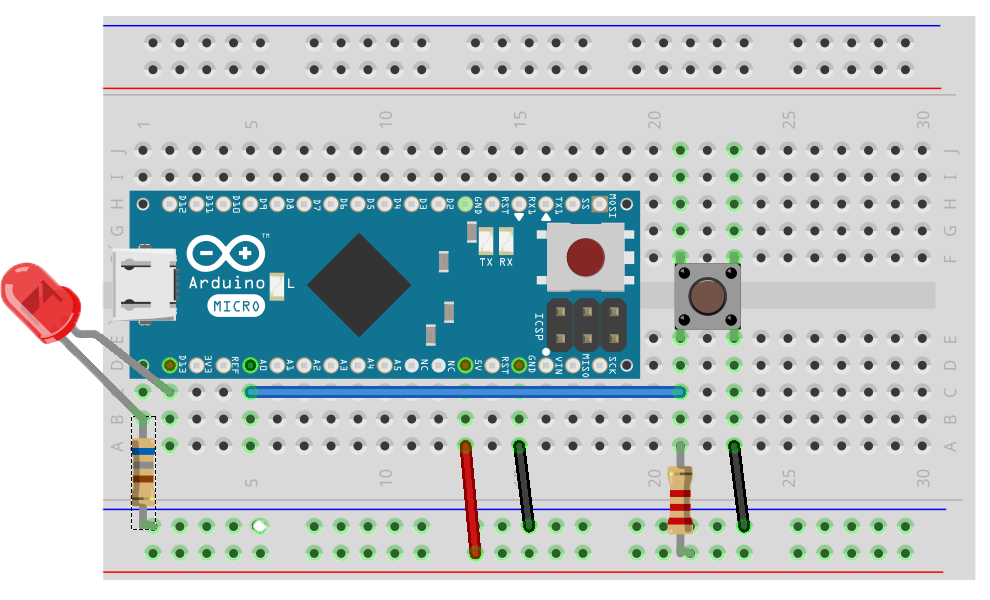

# Ein-Ausgabe Tutorial

Die Basics der NodeBots Programmierung werden hier behandelt.

## Tutorials

* [LED](/exercises/led)
* [Taster](/exercises/button)
* [Tastatur](/exercises/ekeypad)
* [Potentiometer](/exercises/poti)
