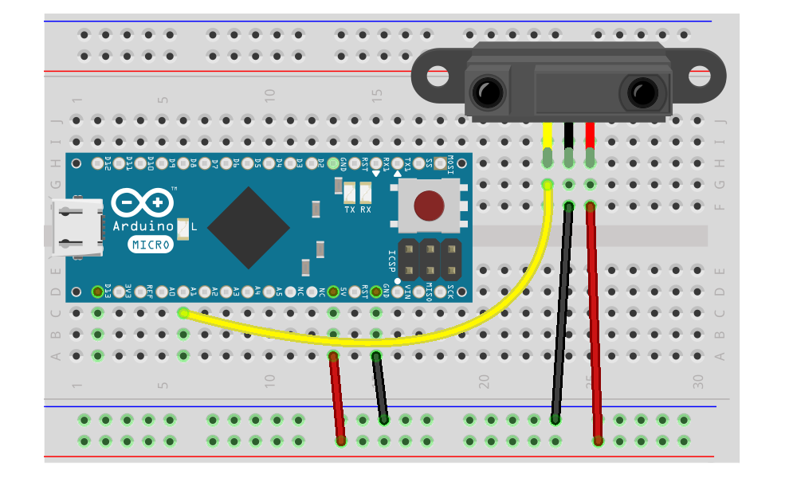

# Roboter Sensoren

In diesem Teil des Robotik Tutorials geht es um Sensoren. Ein Roboter ohne Sensoren ist quasi blind und taub. Er kann seine Umgebung nicht wahrnehmen und würde gegen jedes Hindernis fahren, das sich in seinem Weg befindet.

Es gibt Sensoren für verschiedene Aufgaben, z.B. um Hindernisse zu erkennen oder Linien- Sensoren um den Roboter einer dunklen Linie auf  hellem Grund folgen zu lassen. 

## Tutorials

* [Licht-Sensor](exercises/ldr)
* [Ultraschall-Sensor](exercises/ultrasonic)
* [Infrarot-Sensor](exercises/irs)

